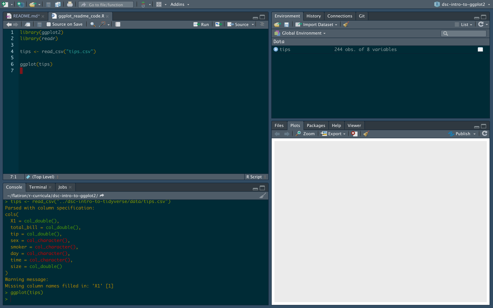
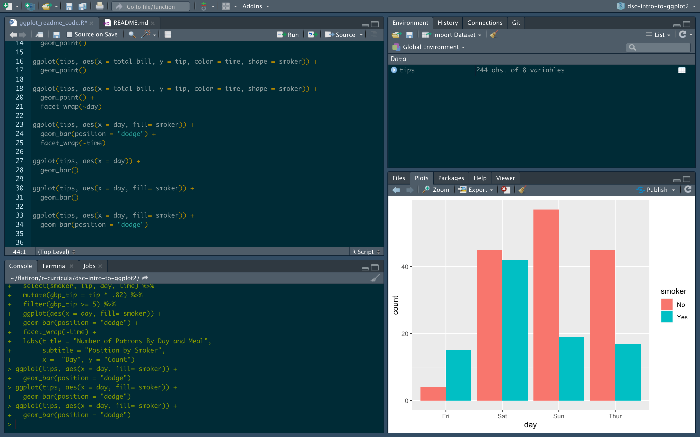
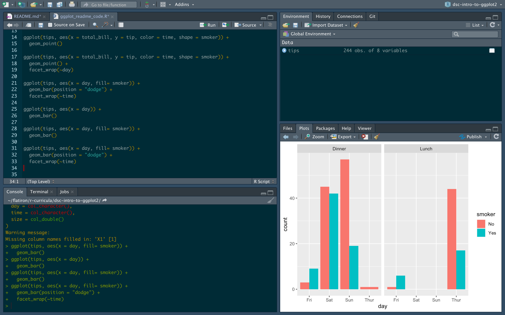

# Intro to ggplot2

## To Do 

* [ ] Create Markdown

## Lesson Goals 

By the end of this lesson, you will be able to:

* [ ] Make a scatter plot in ggplot2  
* [ ] Understand how to build up separate layers in a ggplot
* [ ] Know where to find more resources on learning ggplot2

# ggplot2 

The thing you often hear a lot about with R is how it's great at making graphics. 
This is true.
While there are many packages that you can use for this (just like in Python!), the one we're going to look at here is ggplot2, the main plotting library from the tidyverse!

Let's import both the `readr` package and `ggplot2` to get started then read in our `tips` data again so we can plot what we were looking at in our last lesson. 

```{r}
library(readr) # for getting data
library(ggplot2) # for plotting data

tips <- read_csv("data/tips.csv")

# You can change where this is output above in "Settings (by knit) > Chunk Output in Console"
tips

```

Let's start out by trying to make a scatterplot of our total bill by tips with ggplot.

One thing that we learned from the last lesson is that the first thing that many tidyverse functions expect is the data that we want to manipulate; ggplot2 is no different. 

Let's see what happens if you just run `ggplot()` on our dataset.

```{r}
ggplot(tips)
```

If you run this in your R console, you won't get any errors, but you also won't see anything interesting. 
It might look a bit like this:



There's a big grey area where there should be a plot!
Why isn't there anything there?
Well ggplot can't read your mind and has no idea what we want to plot!

In order to change this, we need to tell it what data we're interested in plotting.
We need to map the data in our dataset to what will end up being the aesthetic properties of our data visualization. 

```{r}
ggplot(tips, aes(x = total_bill, y = tip))
```

The code above gets a bit more explicit about what we want to plot.
Specifically, here we want to put our `total_bill` variable on the x axis and the `tip` variable on the y axis.
If you run that, it will look a bit like this:


What do we see now?
Now ggplot knows what variables you want on each axis and under the hood it does the math to figure out what the mathematial bounds of that variable are.
It names each axis what the variable is and gives us some default spacings.
But where is the data?
Again, we're going to have to tell ggplot how we want our data put onto this space.

In this case, we want to make a scatter plot.
To make a scatter plot in ggplot, we need to add layer of data to the space that we have already created for our data to live. 
We do this with a `geom_*`.
In this case, that will be `geom_point()` since we want to put a bunch of points on this space, but there are many other geoms you can use! 
Read about them [here](https://ggplot2.tidyverse.org/reference/).

Notice here before running the code below that we are adding layers to our ggplot and as a result we need to use the `+` operator and NOT the `%>%` pipe operator.
We mention that now since using the `%>%` in ggplots is a common mistake (especially because of reasons you'll see at the end of this lesson!).

What do you now see?

```{r}
ggplot(tips, aes(x = total_bill, y = tip)) +
  geom_point()
```


It's our points! 
We now have the data on the plot. 
This is pretty much the most basic scatter plot you could make with ggplot.
We mapped our data to two different axes and threw our data on top of it using a layer.
Now if we take advantage of this idea of having different data being mapped to different aesthetics that are availble to us and the fact that we can keep adding layers to this, we can actually do some pretty powerful things with this grammer (the gg in ggplot2 stands for [grammar of graphics](https://www.springer.com/gp/book/9780387245447)!).

So what can we do with this?

Well the first thing we might want to explore is how we can explore mapping other data we have availble to us to other aethetics.

Just like in seaborn, we can use color to our advantage to help bring out different trends.
In order to this, we need to tell ggplot that we want the time variable to be mapped to the color aesthetic as in the code below:

```{r}
ggplot(tips, aes(x = total_bill, y = tip, color = time)) +
  geom_point()
```


But why stop there?

Let's take advantage of the fact that we can use the shape mapping to show another part of our data and map shape to our smoker variable. 

```{r}
ggplot(tips, aes(x = total_bill, y = tip, color = time, shape = smoker)) +
  geom_point()
```


Now that's a lot of data here and you might have a hard time digesting all of that in one go.
But why stop there? 
We have more data in our dataset that we could break up using some other cool features of ggplot. 

For example, we also have data on what day each transaction took place.
If we wanted to make separate plots for each day, we can use the `facet_wrap()` functionality for that 

```{r}
ggplot(tips, aes(x = total_bill, y = tip, color = time, shape = smoker)) +
  geom_point() + 
  facet_wrap(~day)
```


And just like that we have broken up our data into different panels based on a variable already in our dataset!

The other major type of plot you probably find yourself making a lot of in the world of data science are barplots. 

Let's make one using ggplot2! 

Now knowing what you know about ggplot thus far, can you figure out what the plot blow is going to do without actually running it?


```{r}
ggplot(tips, aes(x = day)) +
  geom_bar()
```


```{r}
ggplot(tips, aes(x = day, fill= smoker)) +
  geom_bar()
```


Just like above, to make a ggplot you need to first tell it what data you want to work with, then how you want to map your data to the aesthetic properties of the data visualzation.
Now since we know we are going to make a bar plot, bar plots almost always have counts as the y axis and any other variation on them is going to need the count data to make plots that depend on it like percents. 
Luckily for us, this is easy for us to do in ggplot! 
Note that we only have to map our x variable here and then can use the `fill` aesthetic to futher break down our bars. 
Further, you can also change how this data is presented by altering an argument in the `geom_bar()` layer as shown below to get your bars next to one another. 


```{r}
ggplot(tips, aes(x = day, fill= smoker)) +
  geom_bar(position = "dodge")
```




```{r}
ggplot(tips, aes(x = day, fill= smoker)) +
  geom_bar(position = "fill")
```


And you can also use what we did above to break these down with `facet_wrap()`:

```{r}
ggplot(tips, aes(x = day, fill= smoker)) +
  geom_bar(position = "dodge") + 
  facet_wrap(~time)
```



Now these plots here tell us a lot about the data, but might not be as clear to other people.
Let's make it easier for them to read.

As we learend before, if we want more information on this plot, we need to add on a layer with the `+` operator. 

```{r}
ggplot(tips, aes(x = day, fill= smoker)) +
  geom_bar(position = "dodge") + 
  facet_wrap(~time) +
  labs(title = "Number of Patrons By Day and Meal",
       subtitle = "Position by Smoker",
       x =  "Day", y = "Count")
```


Notice that we add on another layer here with the `labs()` function to add on our title, the name of our axes, and we can even add a subtitle! 

Let's now take a plot from above that we liked and begin to modify it! 


Lastly, let's see something that I also think is quite cool and great for your data science workflow.
If you notice here, the first argument of ggplot() was the dataframe.
If you recall from last time, when we use the `%>%` operator we can take some tibble and pass it to a function where the input of the funciton gets passed as the first argument.
Since we can do this, there's no reason we can't just pass in a large `dplyr` pipeline right to a `ggplot`!
For example, what if we were only interested in plotting the data where people spent over five pounds (after we make the conversion on the fly!)!
The code below shows that:

```{r}
tips %>%
  select(smoker, tip, day, time) %>%
  mutate(gbp_tip = tip * .82) %>%
  filter(gbp_tip >= 5) %>%
  ggplot(aes(x = day, fill= smoker)) +
  geom_bar(position = "dodge") + 
  facet_wrap(~time) +
  labs(title = "Number of Patrons By Day and Meal",
       subtitle = "Position by Smoker",
       x =  "Day", y = "Count")
  
```


This can be very helpful when making analyeses on the fly! 